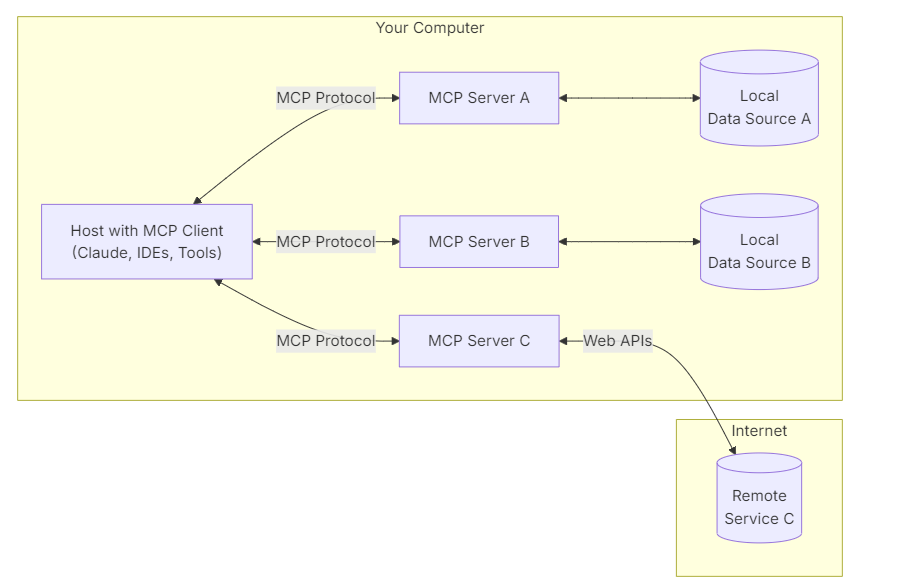

# mcp

# 一 mcp 是什么

[Introduction - Model Context Protocol](https://modelcontextprotocol.io/introduction)

定义

```
MCP is an open protocol that standardizes how applications provide context to LLMs. 
Think of MCP like a USB-C port for AI applications. 
Just as USB-C provides a standardized way to connect your devices to various peripherals 
and accessories, MCP provides a standardized way to connect AI models to 
different data sources and tools.
```

架构



组成部分

- **MCP Hosts**: Programs like Claude Desktop, IDEs, or AI tools that want to access data through MCP
- **MCP Clients**: Protocol clients that maintain 1:1 connections with servers
- **MCP Servers**: Lightweight programs that each expose specific capabilities through the standardized Model Context Protocol
- **Local Data Sources**: Your computer’s files, databases, and services that MCP servers can securely access
- **Remote Services**: External systems available over the internet (e.g., through APIs) that MCP servers can connect to

# 二 为什么用mcp

解决了llm统一调用工具

- A growing list of pre-built integrations that your LLM can directly plug into
- The flexibility to switch between LLM providers and vendors
- Best practices for securing your data within your infrastructure

# 三 怎么用

1. stdio
   
   使用标准输入/输出进行通信
   
   ```
   python raw_std_client.py std_server.py
   ```
   
   ```
   import asyncio
   from typing import Optional
   from contextlib import AsyncExitStack
   
   from mcp import ClientSession, StdioServerParameters
   from mcp.client.stdio import stdio_client
   
   
   from openai import AsyncOpenAI
   from dotenv import load_dotenv
   
   load_dotenv()  # load environment variables from .env
   
   
   base_url = ""
   api_key = ""
   model="deepseek-ai/DeepSeek-V3"
   
   class MCPClient:
       def __init__(self):
           # Initialize session and client objects
           self.session: Optional[ClientSession] = None
           self.exit_stack = AsyncExitStack()
           self.openai = AsyncOpenAI(base_url=base_url, api_key=api_key)
   
       async def connect_to_server(self, server_params):
           """Connect to an MCP server
           
           Args:
               server_script_path: Path to the server script (.py or .js)
           """
           
           stdio_transport = await self.exit_stack.enter_async_context(stdio_client(server_params))
           # print(stdio_transport)
           self.stdio, self.input = stdio_transport
           self.session = await self.exit_stack.enter_async_context(ClientSession(self.stdio, self.input))
           
           await self.session.initialize()
           
           # List available tools
           response = await self.session.list_tools()
           tools = response.tools
           print("\nConnected to server with tools:", [tool.name for tool in tools])
   
       async def process_query(self, query: str) -> str:
           """Process a query using OpenAI and available tools"""
           messages = []
           messages.append(            {
                   "role": "user",
                   "content": query
               })
   
   
           response = await self.session.list_tools()
           available_tools = [
               {
                   "type": "function",
                   "function": {
                       "name": tool.name,
                       "description": tool.description,
                       "parameters": tool.inputSchema
                   }
               } for tool in response.tools
           ]
           # print(available_tools)
   
           # Initial OpenAI API call
           response = await self.openai.chat.completions.create(
               model=model,  # You can change to another model like "gpt-3.5-turbo"
               messages=messages,
               tools=available_tools if available_tools else None,
               tool_choice="auto"
           )
   
           # Process response and handle tool calls
           final_text = []
           response_message = response.choices[0].message
           # print(response_message)
   
           if response_message.content:
               final_text.append(response_message.content)
   
           if hasattr(response_message, 'tool_calls') and response_message.tool_calls:
               for tool_call in response_message.tool_calls:
                   tool_name = tool_call.function.name
                   tool_args = eval(tool_call.function.arguments)  # Convert string to dict
   
                   # Execute tool call
                   print("工具调用:", tool_name, "参数:", tool_args)
   
                   try:
                       result = await self.session.call_tool(tool_name, tool_args)
                   except Exception as e:
                       print(f"调用工具 {tool_name} 失败: {e}")
                       continue
                   
                   print("工具返回:", result)
                   final_text.append(f"[Calling tool {tool_name} with args {tool_args}]")
   
                   # Append assistant message and tool result to conversation
                   messages.append({
                       "role": "assistant",
                       "content": response_message.content or "",
                       "tool_calls": [
                           {
                               "id": tool_call.id,
                               "type": "function",
                               "function": {
                                   "name": tool_name,
                                   "arguments": tool_call.function.arguments
                               }
                           }
                       ]
                   })
                   messages.append({
                       "role": "tool",
                       "content": result.content[0].text,
                       "tool_call_id": tool_call.id
                   })
   
                   print(messages)
           
                   # Get next response from OpenAI
                   response = await self.openai.chat.completions.create(
                       model=model,
                       messages=messages,
                       tools=available_tools if available_tools else None,
                       tool_choice="auto"
                   )
   
                   final_text.append(response.choices[0].message.content or "")
   
           return "\n".join(final_text)
   
       async def chat_loop(self):
           """Run an interactive chat loop"""
           print("\nMCP Client Started!")
           print("Type your queries or 'quit' to exit.")
           
           while True:
               try:
                   query = input("\nQuery: ").strip()
                   
                   if query.lower() == 'quit':
                       break
                       
                   response = await self.process_query(query)
                   print("\n" + response)
                       
               except Exception as e:
                   print(f"\nError: {str(e)}")
       
       async def cleanup(self):
           """Clean up resources"""
           await self.exit_stack.aclose()
   
   async def main():
       server_params = StdioServerParameters(
               command="python",
               args=["std_server.py"],
               env=None
       )         
       client = MCPClient()
       try:
           await client.connect_to_server(server_params)
           await client.chat_loop()
       finally:
           await client.cleanup()
   
   if __name__ == "__main__":
       import sys
       asyncio.run(main())
   ```

2. sse
   
   对服务器到客户端消息使用服务器发送的事件
   
   客户端到服务器消息的 HTTP POST
   
   ```
   python sse_server.py
   python raw_sse_client.py 
   ```

```
import asyncio
from typing import Optional
from contextlib import AsyncExitStack

from mcp import ClientSession, StdioServerParameters
from mcp.client.sse import sse_client
from mcp.client.stdio import stdio_client


from openai import AsyncOpenAI
from dotenv import load_dotenv

load_dotenv()  # load environment variables from .env

class MCPClient:
    def __init__(self):
        # Initialize session and client objects
        self.session: Optional[ClientSession] = None
        self.exit_stack = AsyncExitStack()
        self.openai = AsyncOpenAI(base_url="", api_key="")

    async def connect_to_server(self, server_script_path: str):
        """Connect to an MCP server
        
        Args:
            server_script_path: Path to the server script (.py or .js)
        """
        
        stdio_transport = await self.exit_stack.enter_async_context(sse_client(url="http://localhost:8000/sse", headers={}))
        # print(stdio_transport)
        self.stdio, self.input = stdio_transport
        self.session = await self.exit_stack.enter_async_context(ClientSession(self.stdio, self.input))
        
        await self.session.initialize()
        
        # List available tools
        response = await self.session.list_tools()
        tools = response.tools
        print("\nConnected to server with tools:", [tool.name for tool in tools])

    async def process_query(self, query: str) -> str:
        """Process a query using OpenAI and available tools"""
        messages = [
            {
                "role": "user",
                "content": query
            }
        ]

        response = await self.session.list_tools()
        available_tools = [
            {
                "type": "function",
                "function": {
                    "name": tool.name,
                    "description": tool.description,
                    "parameters": tool.inputSchema
                }
            } for tool in response.tools
        ]
        # print(available_tools)

        # Initial OpenAI API call
        response = await self.openai.chat.completions.create(
            model="deepseek-ai/DeepSeek-V3",  # You can change to another model like "gpt-3.5-turbo"
            messages=messages,
            tools=available_tools if available_tools else None,
            tool_choice="auto"
        )

        # Process response and handle tool calls
        final_text = []
        response_message = response.choices[0].message
        # print(response_message)

        if response_message.content:
            final_text.append(response_message.content)

        if hasattr(response_message, 'tool_calls') and response_message.tool_calls:
            for tool_call in response_message.tool_calls:
                tool_name = tool_call.function.name
                tool_args = eval(tool_call.function.arguments)  # Convert string to dict

                # Execute tool call
                print("工具调用:", tool_name, "参数:", tool_args)

                try:
                    result = await self.session.call_tool(tool_name, tool_args)
                except Exception as e:
                    print(f"调用工具 {tool_name} 失败: {e}")
                    continue
                
                print("工具返回:", result)
                final_text.append(f"[Calling tool {tool_name} with args {tool_args}]")

                # Append assistant message and tool result to conversation
                messages.append({
                    "role": "assistant",
                    "content": response_message.content or "",
                    "tool_calls": [
                        {
                            "id": tool_call.id,
                            "type": "function",
                            "function": {
                                "name": tool_name,
                                "arguments": tool_call.function.arguments
                            }
                        }
                    ]
                })
                messages.append({
                    "role": "tool",
                    "content": result.content[0].text,
                    "tool_call_id": tool_call.id
                })

                print(messages)
        
                # Get next response from OpenAI
                response = await self.openai.chat.completions.create(
                    model="deepseek-ai/DeepSeek-V3",
                    messages=messages,
                    tools=available_tools if available_tools else None,
                    tool_choice="auto"
                )
                final_text.append(response.choices[0].message.content or "")

        return "\n".join(final_text)

    async def chat_loop(self):
        """Run an interactive chat loop"""
        print("\nMCP Client Started!")
        print("Type your queries or 'quit' to exit.")
        
        while True:
            try:
                query = input("\nQuery: ").strip()
                
                if query.lower() == 'quit':
                    break
                    
                response = await self.process_query(query)
                print("\n" + response)
                    
            except Exception as e:
                print(f"\nError: {str(e)}")
    
    async def cleanup(self):
        """Clean up resources"""
        await self.exit_stack.aclose()

async def main():        
    client = MCPClient()
    try:
        await client.connect_to_server("")
        await client.chat_loop()
    finally:
        await client.cleanup()

if __name__ == "__main__":
    import sys
    asyncio.run(main())
```


# 四 参考资料

[Introduction - Model Context Protocol](https://modelcontextprotocol.io/introduction)

https://github.com/openai/openai-agents-python

https://community.openai.com/t/annyoing-output-in-python-console-app/1154835

https://mcp.so/

https://mcpservers.org/
